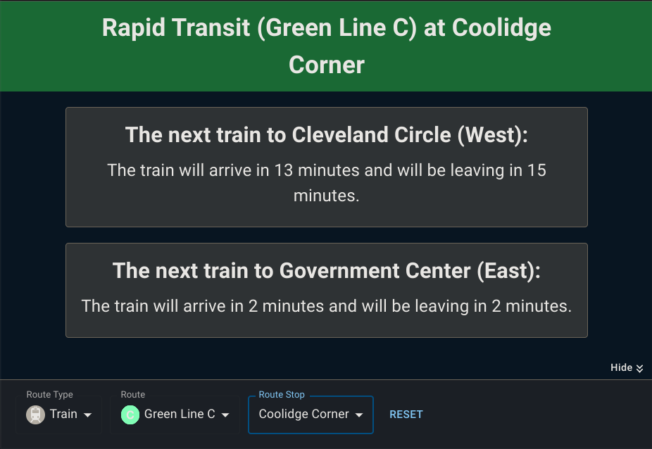

# mbta-stop-display

# 🚀 This project is an experimentation with displaying MBTA stop arrivals for dedicated displays. 🚀

https://github.com/coding-to-music/mbta-stop-display

From / By https://github.com/jprusik/mbta-stop-display

https://jprusik.github.io/mbta-stop-display/

## Environment variables:

```java

```

## GitHub

```java
git init
git add .
git remote remove origin
git commit -m "first commit"
git branch -M main
git remote add origin git@github.com:coding-to-music/mbta-stop-display.git
git push -u origin main
```

# MBTA Stop Display

This is a WiP project to experiment with displaying MBTA line/stop information on an in-home, purpose-built display.

See the app in action: [https://jprusik.github.io/mbta-stop-display/](https://jprusik.github.io/mbta-stop-display/)



This project was bootstrapped with [Create React App](https://github.com/facebook/create-react-app).

## Getting started

Upon build, the app expects to find a dotfile (named `.env`) with environment variables in the project's root directory. See `.env.example` for sample values an additional explanations.

## Available Scripts

In the project directory, you can run:

### `npm start`

Runs the app in the development mode.\
Open [http://localhost:3000](http://localhost:3000) to view it in the browser.

The page will reload if you make edits.\
You will also see any lint errors in the console.

### `npm test`

Launches the test runner in the interactive watch mode.\
See the section about [running tests](https://facebook.github.io/create-react-app/docs/running-tests) for more information.

### `npm run build`

Builds the app for production to the `build` folder.\
It correctly bundles React in production mode and optimizes the build for the best performance.

The build is minified and the filenames include the hashes.\
Your app is ready to be deployed!

See the section about [deployment](https://facebook.github.io/create-react-app/docs/deployment) for more information.

### `npm run eject`

**Note: this is a one-way operation. Once you `eject`, you can’t go back!**

If you aren’t satisfied with the build tool and configuration choices, you can `eject` at any time. This command will remove the single build dependency from your project.

Instead, it will copy all the configuration files and the transitive dependencies (webpack, Babel, ESLint, etc) right into your project so you have full control over them. All of the commands except `eject` will still work, but they will point to the copied scripts so you can tweak them. At this point you’re on your own.

You don’t have to ever use `eject`. The curated feature set is suitable for small and middle deployments, and you shouldn’t feel obligated to use this feature. However we understand that this tool wouldn’t be useful if you couldn’t customize it when you are ready for it.

## Learn More

You can learn more in the [Create React App documentation](https://facebook.github.io/create-react-app/docs/getting-started).

To learn React, check out the [React documentation](https://reactjs.org/).
